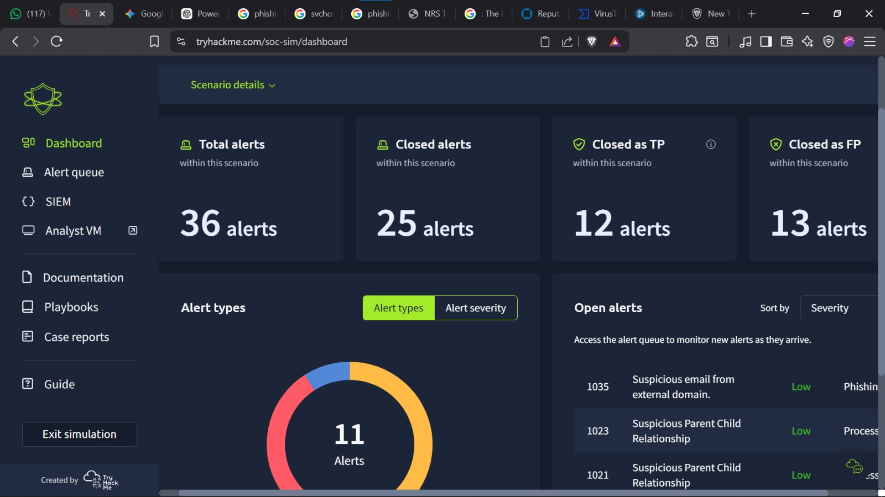
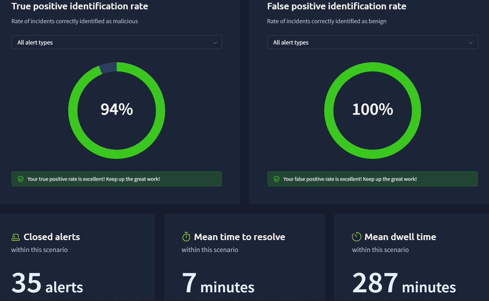
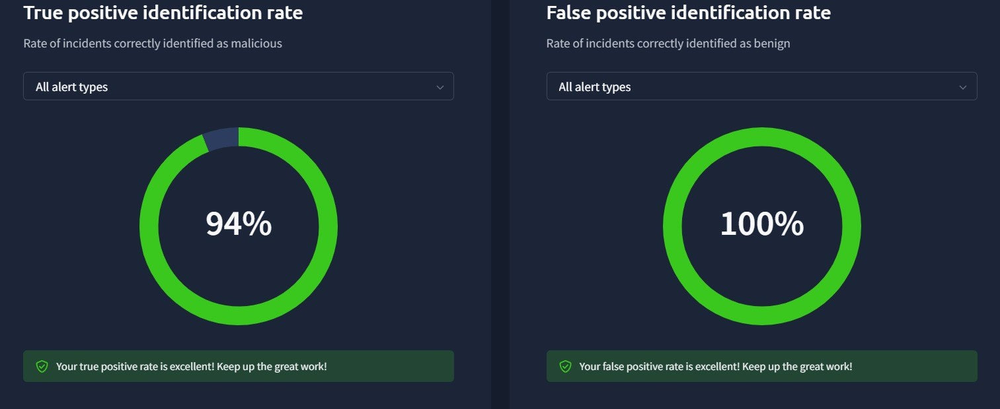
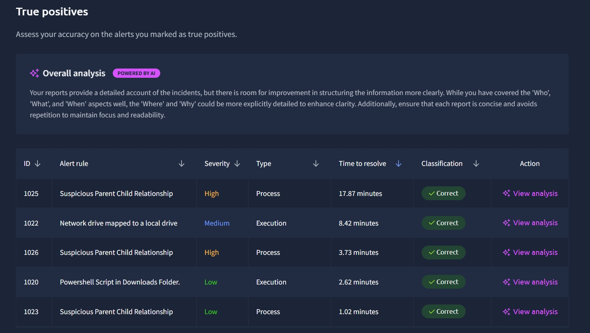
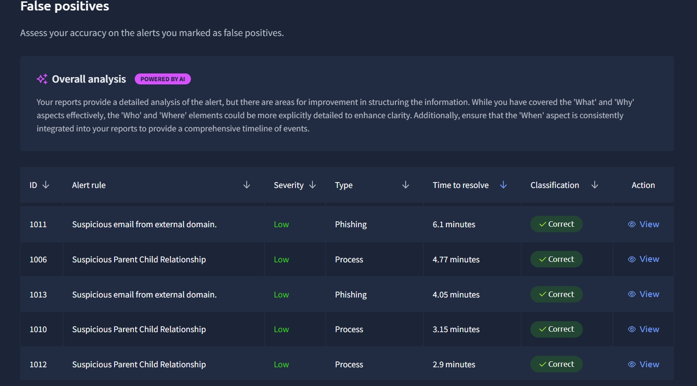

# 🛡️ SOC Incident Detection & Response Simulation Lab

## 📌 Overview
This project showcases my hands-on experience in a simulated Security Operations Center (SOC) environment using TryHackMe labs.  
I investigated multiple real-world attack scenarios including phishing, command-and-control (C2), suspicious process activity, and network-based threats.

The objective was to simulate Tier 1 SOC analyst responsibilities such as alert triage, threat detection, incident investigation, and reporting.

## 🖥️ SIEM Dashboard Overview
The dashboard below was used during one of the SOC simulation labs to monitor and triage alerts, analyze severity levels, and prioritize incident response activities based on real-time security events.

This dashboard was used to monitor alerts, analyze severity levels, and prioritize incident response activities based on real-time security events.

---

## 🎯 Key Achievements

- Investigated **100+ security alerts** across multiple scenarios  
- Achieved **94% true positive identification rate**  
- Maintained **100% false positive accuracy**  
- Average **mean time to resolve: 4 minutes**  
- Performed structured analysis across phishing, endpoint, and network alerts  

---

## 📊 Performance Metrics

### 🔍 Detection Accuracy

- True Positive Rate: **94%**
- False Positive Accuracy: **100%**

---

## 🚨 Alert Analysis

### ✅ True Positives
Correctly identified malicious activities including:
- Suspicious parent-child process relationships  
- Unauthorized script execution  
- Network-based anomalies  

---

### ❌ False Positives
Accurately classified benign alerts such as:
- Legitimate external email communications  
- Normal system process behavior  

---

## 🧪 Scenarios Covered

This simulation includes multiple SOC-focused labs and real-world attack scenarios:

- Phishing Email Investigation (spoofing, malicious links, social engineering, typosquatting & homoglyph attacks)
- Command & Control (C2) Detection
- Brute Force Attacks (authentication abuse and failed login analysis)
- Lateral Movement Detection
- Privilege Escalation Attempts
- Endpoint Process Analysis (suspicious parent-child processes)
- Network Traffic Analysis (PCAP investigation, anomalous traffic)
- Defense Evasion Techniques
- SOC Chaos Simulation (mixed alert environments)

---

## 🔍 Investigation Approach

For each alert, I followed a structured SOC methodology:

1. **Alert Intake & Ownership**
   - Assigned and acknowledged alerts for investigation  
   - Established responsibility for tracking the alert lifecycle  

2. **Alert Triage**
   - Reviewed severity, alert type, and context  
   - Prioritized alerts based on potential impact  

3. **Log Analysis**
   - Analyzed event logs and telemetry data across multiple sources  

4. **Threat Validation**
   - Identified Indicators of Compromise (IOCs)  
   - Correlated findings with known attack patterns  

5. **Classification**
   - Determined whether alerts were True Positives or False Positives  

6. **Reporting & Documentation**
   - Documented findings with clear timelines, affected systems, and impact  
   - Provided recommendations for remediation or further investigation  

---

## 🛠️ Tools Used

- **SIEM:** Splunk, ELK Stack  
- **Network Analysis:** Wireshark  
- **Threat Intelligence:** VirusTotal, Cisco Talos  

---

## 📈 Skills Demonstrated

- Security Monitoring & Alert Triage  
- Incident Detection & Response  
- Log Analysis & Correlation  
- Phishing Investigation  
- Network Traffic Analysis  
- Threat Intelligence & IOC Analysis  

---

## 🧠 Key Takeaways

- Improved accuracy in distinguishing true vs false positives  
- Strengthened ability to analyze diverse alert types  
- Gained hands-on experience with real-world SOC workflows  
- Enhanced reporting and investigation documentation skills  

---

## 📌 Note

All scenarios were conducted in a controlled lab environment for learning and skill development purposes.

---

⭐ *This project reflects practical SOC analyst experience in detecting, analyzing, and responding to security incidents.*

